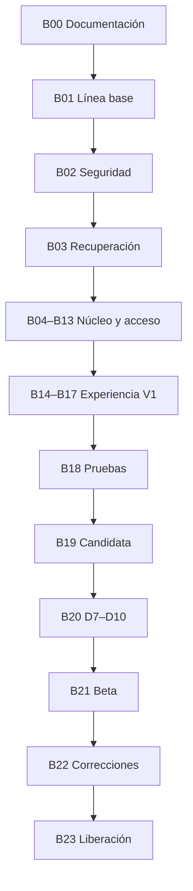

# Plan maestro de ejecución — CronoFinanzas V1

> **Única fuente oficial del progreso de V1.** No crear copias divergentes. Los documentos de ambos repositorios deben enlazar a este archivo.

## 1. Control del documento

| Campo | Valor |
|---|---|
| Estado general | B01 — Línea base reproducible en revisión |
| Última actualización | 16 de agosto de 2026 — America/Lima |
| Contrato aplicable | [Contrato de alcance y salida V1 v0.2](./CONTRACT_SCOPE_RELEASE_V1_v0.2.md) |
| Estado del contrato | Aprobado y cerrado |
| Versión candidata actual | Ninguna |
| Repositorio canónico | `FelipeOA16/CronoFinanzas_Frontend` |
| Rama documental actual | `agent/v1-baseline` |
| Ejecutor autorizado | Codex |
| Propietario del producto | Felipe Ordoñez |

## 2. Estado ejecutivo

| Área | Estado | Observación |
|---|---|---|
| Alcance | Definido | Contrato V1 v0.2 aprobado |
| Documentación canónica | Vigente | B00 terminado; enlazada desde ambos repositorios |
| Integridad financiera | Pendiente de prueba completa | Requiere R2–R10 |
| Seguridad | Riesgo abierto | RLS/exposición Supabase y CORS requieren verificación |
| Respaldo y recuperación | Bloqueado | Supabase no muestra backups; no existe restauración probada |
| Web | Desplegada, no candidata | Firebase no está reconciliado con `main` |
| Android | Pendiente de evidencia V1 | Captura rápida Android existe, falta matriz completa |
| iOS | Pendiente de evidencia V1 | Falta evidencia de captura rápida, notificaciones y build |
| Notificaciones | Parcial | R11 sin evidencia integral |
| Home | Especificado | Implementación pendiente de R9 |
| Beta | No autorizada | Requiere candidata interna y D7–D10 |
| Liberación | No iniciada | Cero críticos/importantes antes de liberar |

## 3. Reglas de gobierno

1. Solo Codex ejecuta cambios.
2. No trabajar directamente sobre `main`.
3. Cada bloque usa una rama propia `agent/{descripcion}`.
4. Solo un bloque puede estar **en ejecución** por repositorio, salvo independencia demostrada y registrada.
5. Dos agentes o procesos no pueden modificar simultáneamente el mismo bloque o archivo.
6. Antes de modificar: identificar y leer íntegramente las fuentes canónicas y reglas aplicables al bloque; después revisar rama, estado, cambios existentes, commits recientes y archivos afectados. Registrar el alcance documental consultado en la evidencia del bloque.
7. No sobrescribir cambios locales o remotos no identificados.
8. Cada bloque debe tener criterios de aceptación y pruebas antes de implementar.
9. Compilar no equivale a terminar.
10. Antes de terminar: análisis, pruebas, revisión del diff y evidencia.
11. Cambios de esquema requieren nueva migración Alembic; no editar migraciones aplicadas.
12. No ejecutar migraciones de producción sin backup, revisión y ventana controlada.
13. Secretos nunca entran al frontend, repositorios, documentación pública, logs, builds ni evidencias.
14. Todo cambio financiero comprueba cuentas, movimientos vinculados, reversiones, presupuestos, reportes y Home cuando corresponda.
15. No añadir funciones fuera del contrato. Las propuestas no bloqueantes van al backlog posterior.
16. La candidata interna requiere cero defectos críticos o importantes abiertos.
17. La beta no inicia hasta completar D7–D10.
18. Un bloque solo pasa a **terminado** después de revisión del orquestador.

## 4. Estados permitidos

| Estado | Criterio |
|---|---|
| Pendiente | Tiene dependencias sin resolver |
| Listo | Alcance, aceptación, riesgos y dependencias preparados |
| En ejecución | Codex trabaja en la rama registrada |
| Bloqueado | Existe impedimento verificable |
| En revisión | Implementación y evidencia entregadas |
| Terminado | Criterios, pruebas, diff y evidencia aprobados |

## 5. Fuentes de verdad

### Vigentes

- Este plan maestro.
- [Contrato V1 v0.2](./CONTRACT_SCOPE_RELEASE_V1_v0.2.md).
- [Especificación del Home de conciencia financiera](./HOME_FINANCIAL_AWARENESS_SPEC.md).
- `docs/design/00_MANIFESTO.md`.
- `docs/design/01_PRODUCT_VISION.md`.
- `docs/design/02_EXPERIENCE_PRINCIPLES.md`.
- `docs/INTEGRATION.md` en ambos repositorios.
- `AGENTS.md` en ambos repositorios.

### Pendientes de incorporar o reconciliar

- Estado maestro aprobado.
- Auditoría integral aprobada.
- Plan de mejora aprobado.
- Capítulos locales aprobados del contrato visual aún no versionados.
- Evidencia completa del despliegue Firebase.
- Estado real de migración Alembic en Supabase.

### Históricas, no canónicas

- `IMPLEMENTATION_SUMMARY.md`.
- `TESTING_GUIDE.md` en su estado actual.
- Informes de readiness como evidencia fechada, no como estado presente.

### Reemplazadas

- “Patrimonio actual” como indicador.
- Home como resumen obligatorio de módulos.
- Web y móvil como copias exactas.
- Completar once documentos visuales como prerrequisito.
- Migraciones automáticas al iniciar el contenedor.

## 6. Matriz R1–R12

| ID | Recorrido | Bloques principales | Plataformas | Puerta |
|---|---|---|---|---|
| R1 | Crear y recuperar acceso | B02, B13, B18 | Web/Android/iOS | Registro, verificación, sesión, cierre y recuperación |
| R2 | Configurar finanzas | B02, B04, B18 | Web/Android/iOS | Cuenta y categorías propias |
| R3 | Registrar dinero | B05, B12, B16, B18 | Web/Android/iOS | Impacto único y reconciliado |
| R4 | Transferir | B06, B12, B18 | Web/Android/iOS | Saldos individuales cambian; total de cuentas no |
| R5 | Controlar presupuesto | B07, B16, B18 | Web/Android/iOS | Progreso y restante correctos |
| R6 | Gestionar deuda | B08, B12, B16, B18 | Web/Android/iOS | Pago y reversión reconciliados |
| R7 | Gestionar préstamo | B09, B12, B16, B18 | Web/Android/iOS | Cobro y reversión reconciliados |
| R8 | Avanzar una meta | B10, B16, B18 | Web/Android/iOS | Aporte, reversión y estado correctos |
| R9 | Comprender el Home | B12, B16–B18 | Web/Android/iOS | Cifras explicables sin asistencia |
| R10 | Consultar reportes | B11, B18 | Web/Android/iOS | Totales trazables a movimientos |
| R11 | Gestionar notificaciones | B14, B17–B18 | Web/Android/iOS | Permisos, entrega, persistencia y apertura |
| R12 | Usar captura rápida | B15, B17–B18 | Android/iOS | Registro único, recuperable y reflejado |

## 7. Controles D1–D10

| ID | Estado | Regla |
|---|---|---|
| D1 | Confirmado | Web responsive, Android e iOS bloquean V1 |
| D2 | Confirmado | Notificaciones internas y persistentes completas |
| D3 | Confirmado | Captura rápida móvil Android e iOS |
| D4 | Confirmado | Home de conciencia financiera |
| D5 | Confirmado | Beta de 5–10 personas tras candidata |
| D6 | Confirmado | Coherencia profesional progresiva |
| D7 | Pendiente antes de beta | Versiones, dispositivos, tamaños y navegadores objetivo |
| D8 | Pendiente antes de beta | Canal, responsable, respuesta y protocolo de incidentes |
| D9 | Pendiente antes de beta | Datos permitidos, aviso y consentimiento |
| D10 | Pendiente antes de beta | TestFlight y distribución controlada Android/web |

## 8. Dependencias

## 9. Registro de bloques

### B00 — Consolidación documental y plan canónico

- **Problema:** las decisiones aprobadas estaban repartidas entre conversaciones, un DOCX local y documentación parcial.
- **Experiencia actual:** Felipe no dispone en GitHub de una única fuente para saber qué está aprobado, qué se ejecuta y qué falta.
- **Modificación:** incorporar contrato, especificación del Home, política de evidencia y este plan.
- **Beneficio:** dirección única y control de alcance.
- **Riesgo:** alterar accidentalmente una decisión durante la conversión.
- **Comprobación:** comparar R1–R12, D1–D10 y decisiones obligatorias con el DOCX aprobado.
- **Repositorio:** Frontend.
- **Rama:** `agent/v1-master-execution-plan`.
- **Estado:** Terminado.
- **Pruebas:** validación de enlaces, estructura Markdown y revisión de diff.
- **Evidencia:** Frontend PR #2 integrado en `72a7359c`; Backend PR #2 integrado en `4aa17ece`.
- **Decisión de Felipe:** aprobada ejecución de B00.
- **Terminado cuando:** PR aprobado e integrado sin cambios funcionales.

### B01 — Línea base reproducible

- **Problema:** no existe una fotografía repetible de análisis, pruebas, builds, migraciones y despliegues.
- **Experiencia actual:** una corrección puede parecer exitosa aunque rompa otra plataforma.
- **Modificación:** inventario de comandos, resultados, versiones, pruebas y fallos iniciales; CI mínima para repetirlos en GitHub Actions.
- **Beneficio:** medir progreso real desde el mismo punto.
- **Riesgo:** confundir fallos de ambiente con defectos de producto.
- **Comprobación:** ejecución limpia de `flutter analyze`, `flutter test`, `pytest`, compile/import, Alembic heads y builds posibles.
- **Repositorio:** ambos.
- **Estado:** En revisión.
- **Dependencia:** B00 terminada.
- **Evidencia:** [`B01_BASELINE_2026-08-15.md`](./EVIDENCE/B01_BASELINE_2026-08-15.md). Frontend CI aprobada en web, Android, iOS y contenedor. Backend: contenedor y controles estructurales aprobados; 5 pruebas aprobadas y 1 smoke fallida, reproducida localmente y en CI.
- **Decisión de Felipe:** autorizó incorporar CI mínima el 15 de agosto de 2026.

### B02 — Seguridad, exposición y aislamiento

- **Problema:** Supabase reporta RLS deshabilitado; CORS tiene default `*`; falta verificar privilegios y accesos cruzados.
- **Experiencia actual:** riesgo de exposición financiera aunque la interfaz parezca normal.
- **Modificación:** revisar Data API, roles, ownership, JWT, sesiones, CORS, secretos, logs y dependencias.
- **Beneficio:** datos de cada usuario protegidos.
- **Riesgo:** activar RLS sin diseño puede bloquear SQLAlchemy.
- **Comprobación:** pruebas negativas con dos usuarios, privilegios efectivos y ausencia de secretos.
- **Repositorio:** ambos y configuración operativa.
- **Estado:** Pendiente.
- **Dependencia:** B01.
- **Recorridos:** R1–R12.
- **Evidencia:** matriz de acceso y resultados sanitizados.
- **Decisión de Felipe:** solo si una medida cambia operación/costo.

### B03 — Backup, restauración, Alembic y rollback

- **Problema:** no hay backup visible ni restauración probada.
- **Experiencia actual:** una falla podría causar pérdida irreversible.
- **Modificación:** política, frecuencia, retención, copia externa, runbook, entorno de restauración y control de migraciones.
- **Beneficio:** recuperación verificable.
- **Riesgo:** restaurar o migrar el entorno incorrecto.
- **Comprobación:** restauración separada y reconciliación de usuarios, cuentas, movimientos, deuda y metas.
- **Repositorio:** backend y operación.
- **Estado:** Bloqueado hasta definir mecanismo viable.
- **Dependencias:** B01–B02.
- **Evidencia:** acta de simulacro con fecha, duración y resultado.
- **Decisión de Felipe:** aprobar costo/mecanismo si el plan gratuito no lo cubre.

### B04 — Cuentas y categorías

- **Problema:** falta demostrar ownership, saldos y restricciones en todos los casos.
- **Experiencia actual:** posible cruce de categorías o manejo confuso de cuentas con historial.
- **Modificación:** reglas y mensajes sin añadir funciones.
- **Beneficio:** base confiable.
- **Riesgo:** afectar módulos que dependen de cuentas/categorías.
- **Comprobación:** R2, eliminación con historial y dos usuarios.
- **Repositorio:** ambos.
- **Estado:** Pendiente.
- **Dependencias:** B02–B03.
- **Evidencia:** pruebas y diff.
- **Decisión:** ninguna.

### B05 — Ingresos, gastos y reversión

- **Problema:** falta reconciliación automatizada de impactos.
- **Experiencia actual:** saldo, presupuesto, reporte o Home podrían diferir.
- **Modificación:** asegurar efecto único y actualización inmediata.
- **Beneficio:** confianza en cada movimiento.
- **Riesgo:** duplicación o reversión incompleta.
- **Comprobación:** R3 con crear, editar y eliminar.
- **Repositorio:** ambos.
- **Estado:** Pendiente.
- **Dependencia:** B04.
- **Evidencia:** saldos antes/después y pruebas.
- **Decisión:** ninguna.

### B06 — Transferencias

- **Problema:** falta validar atomicidad y pertenencia de ambas cuentas.
- **Experiencia actual:** una transferencia podría quedar aplicada parcialmente.
- **Modificación:** operación lógica única y reversión segura.
- **Beneficio:** saldos individuales correctos sin alterar el total.
- **Riesgo:** doble movimiento o mitad de transferencia.
- **Comprobación:** R4, errores y acceso a cuenta ajena.
- **Repositorio:** ambos.
- **Estado:** Pendiente.
- **Dependencia:** B04.
- **Evidencia:** pruebas transaccionales.
- **Decisión:** ninguna.

### B07 — Presupuestos

- **Problema:** falta probar periodos, categorías y reconciliación.
- **Experiencia actual:** margen mensual potencialmente incorrecto.
- **Modificación:** cálculo global/por categoría y estados.
- **Beneficio:** respuesta confiable sobre cuánto puede gastar.
- **Riesgo:** contar movimientos fuera del periodo o duplicados.
- **Comprobación:** R5 con límites y meses distintos.
- **Repositorio:** ambos.
- **Estado:** Pendiente.
- **Dependencia:** B05.
- **Evidencia:** casos calculados y pruebas.
- **Decisión:** ninguna.

### B08 — Deudas

- **Problema:** falta cubrir pagos parciales, topes, vínculos y reversión.
- **Experiencia actual:** deuda y cuenta podrían no coincidir.
- **Modificación:** cerrar integridad de R6.
- **Beneficio:** saldo pendiente confiable.
- **Riesgo:** duplicar pago o revertir solo un lado.
- **Comprobación:** crear, pagar, exceder y revertir.
- **Repositorio:** ambos.
- **Estado:** Pendiente.
- **Dependencia:** B05.
- **Evidencia:** reconciliación completa.
- **Decisión:** ninguna.

### B09 — Préstamos por cobrar

- **Problema:** falta prueba integral de cobros y reversiones.
- **Experiencia actual:** dinero por cobrar y cuenta podrían divergir.
- **Modificación:** cerrar integridad de R7.
- **Beneficio:** posición neta confiable.
- **Riesgo:** cobro duplicado.
- **Comprobación:** crear, cobrar, exceder y revertir.
- **Repositorio:** ambos.
- **Estado:** Pendiente.
- **Dependencia:** B05.
- **Evidencia:** reconciliación.
- **Decisión:** ninguna.

### B10 — Metas

- **Problema:** falta demostrar aporte, estado y reversión.
- **Experiencia actual:** progreso y cuenta podrían diferir.
- **Modificación:** cerrar integridad de R8.
- **Beneficio:** avance real.
- **Riesgo:** meta completada incorrectamente.
- **Comprobación:** activa, completada, exceso y reversión.
- **Repositorio:** ambos.
- **Estado:** Pendiente.
- **Dependencia:** B05.
- **Evidencia:** pruebas.
- **Decisión:** ninguna.

### B11 — Reportes

- **Problema:** falta trazabilidad entre totales y movimientos.
- **Experiencia actual:** el usuario podría ver cifras distintas según pantalla.
- **Modificación:** filtros, periodos, categorías y redondeo.
- **Beneficio:** análisis confiable.
- **Riesgo:** consultas y frontend calculan reglas diferentes.
- **Comprobación:** R10 contra dataset conocido.
- **Repositorio:** ambos.
- **Estado:** Pendiente.
- **Dependencias:** B05–B10.
- **Evidencia:** tabla de reconciliación.
- **Decisión:** ninguna.

### B12 — Saldo actual y posición neta

- **Problema:** persiste el indicador ambiguo “Patrimonio actual”.
- **Experiencia actual:** no queda claro cuánto tiene versus su balance con deudas.
- **Modificación:** implementar definiciones aprobadas.
- **Beneficio:** lectura financiera comprensible.
- **Riesgo:** sumar cuentas inactivas o deudas incorrectamente.
- **Comprobación:** fórmulas contra datos conocidos.
- **Repositorio:** ambos.
- **Estado:** Pendiente.
- **Dependencias:** B04–B11.
- **Recorridos:** R3–R10.
- **Evidencia:** pruebas de cálculo.
- **Decisión:** ninguna.

### B13 — Acceso y recuperación

- **Problema:** R1 no está demostrado con correo real y errores.
- **Experiencia actual:** un usuario puede quedar fuera de su cuenta.
- **Modificación:** registro, verificación, refresh, cierre y Resend.
- **Beneficio:** acceso recuperable.
- **Riesgo:** tokens expuestos o enlaces inválidos.
- **Comprobación:** R1 en tres plataformas.
- **Repositorio:** ambos.
- **Estado:** Pendiente.
- **Dependencia:** B02.
- **Evidencia:** pruebas sanitizadas de correos y sesión.
- **Decisión:** ninguna salvo dominio/remitente si falta.

### B14 — Notificaciones persistentes

- **Problema:** implementación parcial sin evidencia de permisos, entrega, persistencia, duplicados y apertura.
- **Experiencia actual:** avisos pueden no llegar, duplicarse o abrir una pantalla incorrecta.
- **Modificación:** flujo completo interno/sistema.
- **Beneficio:** compromisos accionables.
- **Riesgo:** fatiga, zona horaria o avisos falsos.
- **Comprobación:** R11 abierta/cerrada, permisos aceptados/denegados y deduplicación.
- **Repositorio:** ambos.
- **Estado:** Pendiente.
- **Dependencias:** B02, B08–B13.
- **Evidencia:** matriz Android/iOS/web.
- **Decisión:** ninguna sobre alcance.

### B15 — Captura rápida móvil

- **Problema:** Android tiene evidencia parcial; iOS no.
- **Experiencia actual:** recorrido desigual por plataforma.
- **Modificación:** acceso flotante interno Android/iOS, conservación y registro único.
- **Beneficio:** registro rápido con una mano.
- **Riesgo:** duplicación, datos perdidos o controles tapados.
- **Comprobación:** R12 e interrupciones.
- **Repositorio:** frontend y backend si cambia contrato API.
- **Estado:** Pendiente.
- **Dependencias:** B04–B06, B13.
- **Evidencia:** grabación sanitizada y pruebas.
- **Decisión:** ninguna; iOS puede usar botón flotante interno.

### B16 — Home de conciencia financiera

- **Problema:** Home sobrecargado y con concepto ambiguo.
- **Experiencia actual:** mucha información sin prioridad.
- **Modificación:** aplicar la especificación aprobada.
- **Beneficio:** situación y próxima atención comprensibles.
- **Riesgo:** ocultar información útil o cambiar cálculos.
- **Comprobación:** R9 y actualización tras operaciones.
- **Repositorio:** principalmente frontend.
- **Estado:** Pendiente.
- **Dependencias:** B07–B15.
- **Evidencia:** pruebas y capturas por tamaño.
- **Decisión:** ninguna.

### B17 — Coherencia visual y responsive

- **Problema:** flujos creados en momentos distintos.
- **Experiencia actual:** inconsistencias, overflow o controles incómodos.
- **Modificación:** Design System progresivo en R1–R12.
- **Beneficio:** producto coherente en web/Android/iOS.
- **Riesgo:** cambios estéticos alteran comportamiento.
- **Comprobación:** estados, contraste, áreas seguras y breakpoints.
- **Repositorio:** frontend.
- **Estado:** Pendiente.
- **Dependencias:** bloques funcionales.
- **Evidencia:** matriz visual.
- **Decisión:** ninguna salvo conflicto visual real.

### B18 — Automatización y revisión integral

- **Problema:** cobertura financiera insuficiente y sin CI visible.
- **Experiencia actual:** regresiones detectadas tarde.
- **Modificación:** unitarias, integración, frontend crítico y CI.
- **Beneficio:** candidata repetible.
- **Riesgo:** tests frágiles o dependientes de producción.
- **Comprobación:** ejecución limpia repetible.
- **Repositorio:** ambos.
- **Estado:** Pendiente; pruebas se agregan incrementalmente antes.
- **Dependencias:** B02–B17.
- **Evidencia:** checks y logs.
- **Decisión:** ninguna.

### B19 — Candidata interna identificable

- **Problema:** despliegues actuales no forman una versión común verificable.
- **Experiencia actual:** no se sabe qué frontend y backend se están probando juntos.
- **Modificación:** commits/releases, builds y despliegue candidato.
- **Beneficio:** misma versión para todos.
- **Riesgo:** Firebase desactualizado o migración incompatible.
- **Comprobación:** health, commit, smoke y R1–R12.
- **Repositorio:** ambos/operación.
- **Estado:** Pendiente.
- **Dependencias:** B03 y B18.
- **Evidencia:** manifiesto de candidata.
- **Decisión:** ninguna.

### B20 — Confirmación D7–D10

- **Problema:** beta aún no tiene dispositivos, canal, consentimiento ni distribución definidos.
- **Beneficio:** beta controlada y recuperable.
- **Riesgo:** soporte caótico o datos sensibles.
- **Comprobación:** cuatro controles aprobados y medios listos.
- **Estado:** Pendiente.
- **Dependencia:** B19.
- **Decisión de Felipe:** obligatoria para D7–D10.

### B21 — Beta cerrada

- **Problema:** falta validación con personas reales.
- **Modificación:** 5–10 personas durante 14 días.
- **Beneficio:** validar comprensión y estabilidad.
- **Riesgo:** uso de datos sensibles o incidencias sin canal.
- **Comprobación:** tareas del contrato y severidad registrada.
- **Estado:** Pendiente.
- **Dependencia:** B20.
- **Evidencia:** informe de beta.
- **Decisión de Felipe:** autorizar inicio.

### B22 — Corrección de bloqueadores de beta

- **Problema:** defectos reales encontrados.
- **Modificación:** ramas por defecto o grupo independiente.
- **Beneficio:** producto liberable.
- **Riesgo:** regresiones de última hora.
- **Comprobación:** reproducción, prueba y retest.
- **Estado:** Pendiente.
- **Dependencia:** B21.
- **Evidencia:** PR y cierre.
- **Decisión:** solo para cambios de alcance/riesgo.

### B23 — Liberación V1

- **Problema:** falta cierre formal.
- **Modificación:** cero críticos/importantes, tags/releases, operación y backlog.
- **Beneficio:** V1 identificable y mantenible.
- **Riesgo:** publicar una combinación distinta de la candidata.
- **Comprobación:** puerta objetiva completa.
- **Estado:** Pendiente.
- **Dependencia:** B22.
- **Evidencia:** release y acta.
- **Decisión de Felipe:** autorizar liberación.

## 10. Riesgos abiertos

| ID | Riesgo | Severidad inicial | Bloque |
|---|---|---|---|
| RK-01 | RLS deshabilitado/exposición potencial de tablas públicas | Crítico hasta descartar exposición | B02 |
| RK-02 | Sin backup visible ni restauración probada | Crítico | B03 |
| RK-03 | CORS default `*` si producción no lo sobrescribe | Importante | B02 |
| RK-04 | Firebase no reconciliado con `main` | Importante | B19 |
| RK-05 | iOS sin evidencia de R11/R12 | Importante | B14–B15 |
| RK-06 | Cobertura financiera insuficiente | Importante | B18 |
| RK-07 | Render Free puede tardar 50+ segundos tras inactividad | Conveniente/operativo | B19–B20 |
| RK-08 | Documentación técnica contradictoria sobre migraciones | Importante | B00–B03 |
| RK-09 | Uso residual de “Patrimonio actual” | Importante para R9 | B12–B16 |

## 11. Decisiones pendientes de Felipe

No existe una decisión inmediata adicional durante B00.

Antes de beta:

- D7: dispositivos/versiones/navegadores.
- D8: canal y soporte.
- D9: datos y consentimiento.
- D10: distribución.
- Autorización expresa para iniciar beta.

Antes de liberación:

- Autorización final de V1.

## 12. Pull requests y commits

| Bloque | Rama | Commits | PR |
|---|---|---|---|
| B00 | `agent/v1-master-execution-plan` / `agent/link-v1-master-plan` | Frontend `72a7359c`; Backend `4aa17ece` | Frontend #2 y Backend #2, integrados |
| B01 | `agent/v1-baseline` en ambos repositorios | Pendientes de validación remota y cierre | Frontend #3 y Backend #3, en borrador |

## 13. Próximo bloque recomendado

1. Revisar y corregir por separado la prueba smoke backend incompatible con las dependencias actuales.
2. Definir la estrategia de fijación de dependencias backend y dejar CI verde reproducible.
3. Cerrar B01 y abrir B02 — seguridad, exposición y aislamiento.

## 14. Historial de estados

| Fecha | Bloque | Cambio | Motivo |
|---|---|---|---|
| 2026-08-12 | Contrato | Aprobado y cerrado | Felipe confirmó alcance V1 v0.2 |
| 2026-08-13 | B00 | Pendiente → En ejecución | Felipe autorizó consolidación documental |
| 2026-08-13 | B00 | En ejecución → En revisión | Documentos canónicos preparados en rama propia |

| 2026-08-15 | B00 | En revisión → Terminado | PR #2 integrado en frontend y backend enlazado al plan canónico |
| 2026-08-15 | B01 | Pendiente → En ejecución | Checkouts limpios y primera batería backend ejecutada; frontend/Docker pendientes por entorno |
| 2026-08-15 | B01 | En ejecución | Felipe autorizó CI mínima reproducible para ambos repositorios |
| 2026-08-15 | B01 | En ejecución → En revisión | Frontend CI completa aprobada; backend reproduce 5 pruebas aprobadas y 1 smoke fallida, con contenedor aprobado |
| 2026-08-16 | B01 | En revisión | Felipe autorizó corregir la prueba smoke y fijar dependencias; además priorizó leer y documentar las fuentes aplicables antes de cada cambio |
